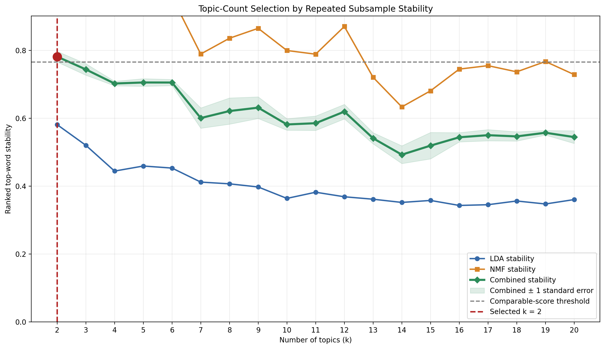
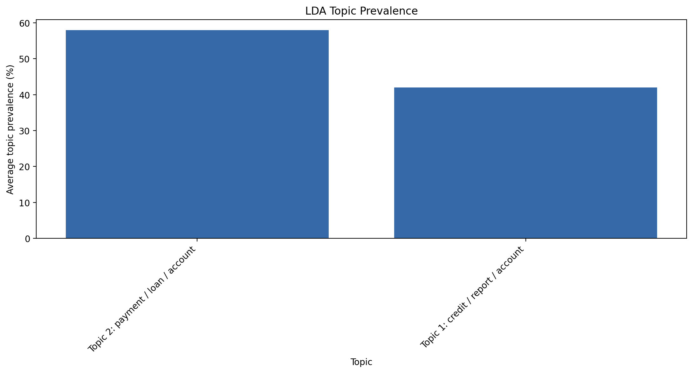
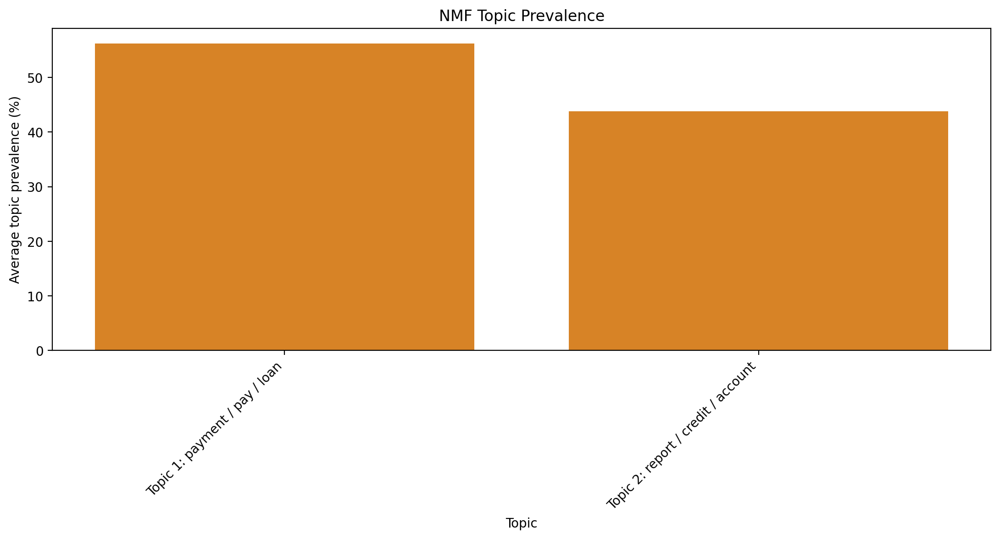
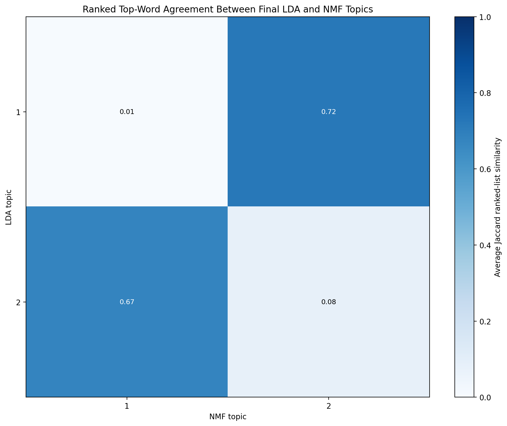

# NLP Analysis of Consumer Complaints

**IU DLBDSEDA02 – Task 1 Development Phase**  
**Student:** Leo Steiner

## Project overview

This project applies natural language processing and unsupervised topic
modelling to consumer complaint narratives. Its objective is to identify the
most prevalent complaint themes and compare the results produced by Latent
Dirichlet Allocation (LDA) and Non-negative Matrix Factorization (NMF).

## Dataset

The analysis uses the [Consumer Complaint Database on Kaggle](https://www.kaggle.com/datasets/selener/consumer-complaint-database).
The original CSV is not stored in this repository because of its size. The
notebook removed missing and duplicate narratives before creating a
reproducible sample of 10,000 unique complaints with `random_state=42`. All
10,000 sampled narratives remained usable after preprocessing.

## Data preparation

The workflow converts narratives to lowercase and removes URLs, email
addresses, numbers, punctuation and masked `XXXX` content. It then tokenizes
the text, removes English stopwords and lemmatizes the remaining words. Three
before-and-after examples and data-quality summaries are shown in the
notebook.

## Vectorization comparison

Both vectorizers produced a sparse matrix containing 10,000 documents and
4,415 features:

- **CountVectorizer** stores word frequencies and supplies the non-negative
  count data required by LDA.
- **TF-IDF** reduces the influence of terms occurring in many complaints, so
  more topic-specific terms contribute more strongly to NMF.

They use the same filtered vocabulary but different numerical weights. Their
highest-ranked terms and matrix statistics are available in
`top_count_terms.csv`, `top_tfidf_terms.csv` and
`vectorization_comparison.csv`.

## Topic modelling and topic-count selection

LDA models topics as probability distributions over words, while NMF
factorizes the TF-IDF matrix into non-negative document-topic and topic-term
representations (Blei et al., 2003; Lee & Seung, 1999).

The topic count was identified through term-centric stability analysis rather
than subjective inspection. For every candidate from `k=2` to `k=20`, LDA and
NMF were fitted to five repeated 80% subsamples. Topics were matched with the
Hungarian algorithm, and agreement between ranked top-ten word lists was
measured using Average Jaccard similarity (Greene et al., 2014).

LDA and NMF stability scores were averaged. A solution was considered
comparable with the maximum when it fell within the larger of 0.01 or one
standard error of the best score. Among comparable solutions with topic
diversity of at least 0.70, the smaller solution was preferred.

## Main results

| Measure | Result |
|---|---:|
| Documents analysed | 10,000 |
| Features per vectorization method | 4,415 |
| Selected topic count | 2 |
| Highest combined stability | 0.7813 |
| Matched LDA–NMF top-word agreement | 0.6960 |
| LDA C_v coherence | 0.4810 |
| NMF C_v coherence | 0.5192 |

Both methods identified the same two broad themes: payment and loan servicing,
and credit reporting and debt disputes. Their topic proportions were also
similar. NMF produced the higher supporting coherence score, while the 0.6960
matched-word agreement shows that the models largely agreed despite
differences in word order and weighting.

### LDA topics

- **Topic 2 – Payment, loan and account servicing:** payment, loan, account,
  pay, bank, call, make, get, time, card — **58.02%** average prevalence.
- **Topic 1 – Credit reporting and debt disputes:** credit, report, account,
  debt, information, dispute, collection, remove, file, letter — **41.98%**
  average prevalence.

### NMF topics

- **Topic 1 – Payment and loan servicing:** payment, pay, loan, call, make,
  bank, get, time, month, account — **56.20%** average prevalence.
- **Topic 2 – Credit reporting and disputes:** report, credit, account, remove,
  debt, dispute, information, collection, bureau, inquiry — **43.80%** average
  prevalence.

## Visual results

### Topic-count stability



### Topic prevalence





### Agreement between LDA and NMF



## Repository structure

```text
README.md
requirements.txt
task1_nlp_analysis.ipynb
.gitignore
LICENSE
results/
    README.md
    cleaning_summary.csv
    data_quality_summary.csv
    vectorization_comparison.csv
    top_count_terms.csv
    top_tfidf_terms.csv
    model_evaluation.csv
    model_evaluation.png
    topic_words.csv
    lda_topic_prevalence.csv
    lda_topic_prevalence.png
    lda_topic_words.png
    nmf_topic_prevalence.csv
    nmf_topic_prevalence.png
    nmf_topic_words.png
    lda_nmf_topic_comparison.csv
    lda_nmf_topic_overlap.png
    top_products.png
    result_summary.json
```

## Run the analysis

1. Open the [Kaggle notebook](https://www.kaggle.com/code/leosteiner0/consumer-complaint-analysis).
2. Select **Copy & Edit** if necessary.
3. Attach the Consumer Complaint Database through **Add Input**.
4. Use a standard CPU session.
5. Select **Restart Session**, followed by **Run All**.
6. Confirm that the final cell reports
   `DEVELOPMENT-PHASE ANALYSIS COMPLETED AND VALIDATED`.
7. Download the completed notebook and the generated files under
   `/kaggle/working`.

The notebook is designed to run without internet access. If an optional NLTK
corpus is unavailable, a documented rule-based lemmatization fallback is used.
If Gensim cannot be imported, only the supporting coherence calculation is
skipped; the stability-based topic-count selection still runs.

## Limitations

- Sampling may exclude rare complaint themes.
- Stability measures reproducibility, not guaranteed semantic usefulness.
- Preprocessing choices influence the resulting topic structure.
- Automatic labels summarize top terms and still require human interpretation.
- Two topics provide stable high-level categories but can combine narrower
  complaint issues that a more detailed model would separate.
- The selected topic count applies to this sample and modelling configuration.

## Project links

- [GitHub repository](https://www.kaggle.com/code/leosteiner0/consumer-complaint-analysis)
- [Kaggle notebook](https://www.kaggle.com/code/leosteiner0/consumer-complaint-analysis)
- [Kaggle dataset](https://www.kaggle.com/datasets/selener/consumer-complaint-database)

## References

Blei, D. M., Ng, A. Y., & Jordan, M. I. (2003). Latent Dirichlet
allocation. *Journal of Machine Learning Research, 3*, 993–1022.
[https://www.jmlr.org/papers/volume3/blei03a/blei03a.pdf](https://www.jmlr.org/papers/volume3/blei03a/blei03a.pdf)

Greene, D., O'Callaghan, D., & Cunningham, P. (2014). How many topics?
Stability analysis for topic models. In *Machine Learning and Knowledge
Discovery in Databases* (pp. 498–513). Springer.
[https://doi.org/10.1007/978-3-662-44848-9_32](https://doi.org/10.1007/978-3-662-44848-9_32)

Lee, D. D., & Seung, H. S. (1999). Learning the parts of objects by
non-negative matrix factorization. *Nature, 401*, 788–791.
[https://doi.org/10.1038/44565](https://doi.org/10.1038/44565)

Reyes, S. (2019). *Consumer Complaint Database* [Data set]. Kaggle.
[https://www.kaggle.com/datasets/selener/consumer-complaint-database](https://www.kaggle.com/datasets/selener/consumer-complaint-database)
